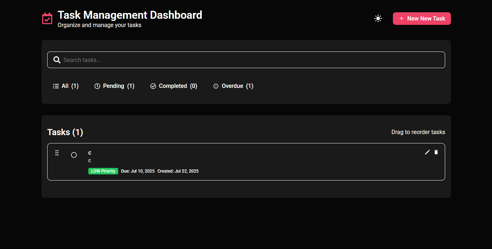

# Task Management Dashboard

A minimal, responsive and customizable task management dashboard built for organizing task.



## Table of Contents

- [Task Management Dashboard](#task-management-dashboard)
  - [Table of Contents](#table-of-contents)
  - [✨ Features](#-features)
  - [🚀 Installation](#-installation)
    - [Prerequisites](#prerequisites)
    - [Quick Start](#quick-start)
  - [🏗️ Built With](#️-built-with)
  - [📁 Folder Structure](#-folder-structure)
  - [🏗️ Architectural Decisions](#️-architectural-decisions)

## ✨ Features

- Add, edit, and delete tasks
- Light/Dark theme toggle
- Reorder tasks with drag-and-drop
- Filter by status
- Search tasks by title or description

## 🚀 Installation

### Prerequisites

Here is what you need to be able to run.

- Node.js (version 22.0 or higher)

### Quick Start

```bash
# Clone the repository
git clone https://github.com/balikis-oyeleye/task-management-engineering-evaluation.git

# Navigate to project directory
cd your-project

# Install dependencies
npm install

# Start the application
npm run dev
```

## 🏗️ Built With

* Vite
* DND kit
* Radix-ui
* sonner

## 📁 Folder Structure
```
└── 📁public
    └── vite.svg
└── 📁src
    └── 📁assets
        ├── preview.png
        ├── react.svg
    └── 📁components
        └── 📁ui
            └── 📁button
                ├── button.module.css
                ├── button.tsx
            └── 📁modal
                ├── modal.module.css
                ├── modal.tsx
            └── 📁search
                ├── search.module.css
                ├── search.tsx
            └── 📁select
                ├── select.module.css
                ├── select.tsx
    └── 📁features
        └── 📁dashboard
            └── 📁filters
                ├── filters.module.css
                ├── filters.tsx
            └── 📁header
                ├── header.module.css
                ├── header.tsx
            └── 📁service
                ├── schema.ts
                ├── type.ts
                ├── utils.ts
            └── 📁store
                ├── modal-store.ts
                ├── task-store.ts
                ├── theme-store.ts
            └── 📁tasks
                ├── task-item.module.css
                ├── task-item.tsx
                ├── tasks.module.css
                ├── tasks.tsx
            ├── dashboard.module.css
            ├── dashboard.tsx
            ├── task-modal.module.css
            ├── task-modal.tsx
    ├── app.tsx
    ├── index.css
    ├── main.tsx
    └── vite-env.d.ts
```


## 🏗️ Architectural Decisions
- Used co-location for folder structure.
- Zustand for state management due to its simplicity and persistence capabilities.
- React Hook Form + Zod for form validation.
- Radix UI for accessible UI components.
